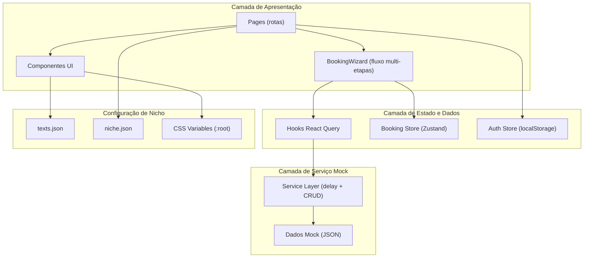

# Documento de Design — Client Scheduling App

## Visão Geral

A aplicação de agendamento voltada ao cliente final (trinity-scheduler-client) é uma SPA React que permite ao usuário se identificar por telefone e agendar serviços em um fluxo de etapas (wizard). O nicho inicial é barbearia, mas a arquitetura é projetada para troca de nicho via arquivos JSON de textos, tokens Tailwind de tema e configuração de nicho.

Não há backend real — todos os hooks utilizam React Query com dados mock e `console.log` para simular operações. A stack segue o padrão já estabelecido no `trinity-scheduler-admin`: React 18, React Router, React Hook Form + Zod, TanStack React Query, Tailwind CSS com CSS variables e Vite.

### Decisões de Design

- **Fluxo wizard multi-etapas**: O agendamento segue um fluxo linear (Serviço → Profissional → Data/Horário → Confirmação) com navegação para trás preservando seleções. Isso simplifica a UX mobile.
- **Autenticação simplificada**: Sem senha, sem OTP. O telefone gera um `clientId` mock armazenado em localStorage. Suporte a deep link com `clientId` na URL.
- **Camada de serviço mock**: Seguindo o padrão do admin, cada entidade tem um arquivo mock, um service com delay simulado e um hook React Query.
- **Textos externalizados em JSON**: Todos os textos da UI vêm de um arquivo `texts.json` organizado por página, permitindo troca de nicho sem alterar componentes.
- **Tema via CSS variables + Tailwind tokens**: Cores definidas como CSS custom properties no `:root`, consumidas via `tailwind.config.ts`. Trocar nicho = trocar variáveis CSS.

## Arquitetura



### Estrutura de Pastas

```
src/
├── components/
│   ├── ui/              # Componentes base (Button, Card, Skeleton, Input, etc.)
│   ├── booking/         # Componentes do wizard de agendamento
│   └── layout/          # Header, MobileLayout, etc.
├── hooks/               # Hooks React Query (useServices, useProfessionals, etc.)
├── services/            # Camada de serviço mock (serviceService, etc.)
├── mocks/               # Dados mock por entidade
├── stores/              # Zustand stores (auth, booking)
├── pages/               # Páginas/rotas
├── config/
│   ├── texts.json       # Textos externalizados por página
│   └── niche.json       # Configuração do nicho (nome, logo, metadados)
├── schemas/             # Schemas Zod de validação
├── lib/                 # Utilitários (cn, formatters)
├── App.tsx
├── main.tsx
└── index.css            # CSS variables do tema
```

## Componentes e Interfaces

### Rotas

| Rota | Página | Descrição |
|------|--------|-----------|
| `/` | `LoginPage` | Identificação por telefone |
| `/booking` | `BookingPage` | Wizard de agendamento (contém as 4 etapas) |
| `/booking/success` | `BookingSuccessPage` | Tela de sucesso pós-agendamento |
| `/appointments` | `AppointmentsPage` | Lista de agendamentos do cliente |
| `/appointments/:id` | `AppointmentDetailPage` | Detalhe com opção de cancelamento |

### Componentes Principais

**Layout**
- `MobileLayout` — Layout wrapper com header, conteúdo e navegação inferior
- `Header` — Logo do nicho + botão de sair (carregados de `niche.json` e `texts.json`)

**Booking Wizard**
- `BookingWizard` — Orquestra as etapas, gerencia estado via Zustand store
- `StepIndicator` — Indicador visual de progresso (etapa atual / total)
- `ServiceSelection` — Grid de cards de serviços
- `ProfessionalSelection` — Lista de profissionais com foto e nome + opção "Sem preferência"
- `DateTimeSelection` — Calendário (30 dias) + grade de horários disponíveis
- `BookingConfirmation` — Resumo com todos os dados + botão confirmar

**Shared**
- `ServiceCard` — Card de serviço (nome, duração, preço, ícone)
- `ProfessionalCard` — Card de profissional (foto, nome)
- `TimeSlotGrid` — Grade de horários disponíveis
- `SkeletonList` — Skeleton loading genérico para listas

### Interfaces dos Hooks

```typescript
// useAuth
interface UseAuth {
  clientId: string | null;
  isAuthenticated: boolean;
  login: (phone: string) => Promise<string>; // retorna clientId
  loginFromUrl: (clientId: string) => void;
  logout: () => void;
}

// useServices
interface UseServices {
  services: Service[];
  isLoading: boolean;
}

// useProfessionals
interface UseProfessionals {
  professionals: Professional[];
  isLoading: boolean;
}

// useAvailableSlots
interface UseAvailableSlots {
  slots: TimeSlot[];
  isLoading: boolean;
  disabledDates: string[]; // datas sem horários
}

// useAppointments
interface UseAppointments {
  upcoming: Appointment[];
  past: Appointment[];
  isLoading: boolean;
}

// useCreateAppointment
interface UseCreateAppointment {
  mutate: (data: CreateAppointmentPayload) => void;
  isLoading: boolean;
  isSuccess: boolean;
  isError: boolean;
}

// useCancelAppointment
interface UseCancelAppointment {
  mutate: (appointmentId: string) => void;
  isLoading: boolean;
  isError: boolean;
}
```

### Booking Store (Zustand)

```typescript
interface BookingState {
  currentStep: number; // 0-3
  selectedService: Service | null;
  selectedProfessional: Professional | null;
  selectedDate: string | null;
  selectedTime: string | null;

  setService: (service: Service) => void;
  setProfessional: (professional: Professional | null) => void;
  setDateTime: (date: string, time: string) => void;
  goToStep: (step: number) => void;
  nextStep: () => void;
  prevStep: () => void;
  reset: () => void;
}
```

### Schemas Zod

```typescript
// phoneSchema
const phoneSchema = z.object({
  phone: z.string()
    .regex(/^\d+$/, textos.validacao.apenasNumeros)
    .min(10, textos.validacao.telefoneMinimo)
    .max(15, textos.validacao.telefoneMaximo),
});
```

## Modelos de Dados

### Entidades

```typescript
interface Service {
  id: string;
  name: string;
  duration: number;   // minutos
  price: number;
  description: string;
  icon?: string;       // nome do ícone Lucide
}

interface Professional {
  id: string;
  name: string;
  avatar: string;      // URL ou placeholder
  specialties: string[];
}

interface TimeSlot {
  time: string;        // "09:00", "09:30", etc.
  available: boolean;
}

interface DayAvailability {
  date: string;        // "2025-03-15"
  slots: TimeSlot[];
}

interface Appointment {
  id: string;
  clientId: string;
  serviceId: string;
  serviceName: string;
  professionalId: string;
  professionalName: string;
  date: string;
  time: string;
  duration: number;
  price: number;
  status: "confirmed" | "cancelled" | "completed";
}

interface CreateAppointmentPayload {
  clientId: string;
  serviceId: string;
  professionalId: string | null; // null = sem preferência
  date: string;
  time: string;
}
```

### Configuração de Nicho

```typescript
// niche.json
interface NicheConfig {
  businessName: string;
  logo: string;           // caminho para o logo
  niche: string;          // "barbearia", "salao", "clinica"
  currency: string;       // "BRL"
  locale: string;         // "pt-BR"
}
```

### Estrutura do Arquivo de Textos

```typescript
// texts.json (estrutura parcial)
interface AppTexts {
  login: {
    titulo: string;
    subtitulo: string;
    placeholder: string;
    botaoEntrar: string;
  };
  booking: {
    etapas: string[];
    servico: { titulo: string; subtitulo: string };
    profissional: { titulo: string; subtitulo: string; semPreferencia: string };
    dataHorario: { titulo: string; subtitulo: string; semHorarios: string };
    confirmacao: { titulo: string; botaoConfirmar: string; botaoVoltar: string };
    sucesso: { titulo: string; mensagem: string; botaoNovo: string };
  };
  agendamentos: {
    titulo: string;
    proximos: string;
    anteriores: string;
    cancelar: string;
    confirmarCancelamento: string;
    vazio: string;
  };
  validacao: {
    apenasNumeros: string;
    telefoneMinimo: string;
    telefoneMaximo: string;
  };
  geral: {
    carregando: string;
    erro: string;
    tentarNovamente: string;
    sair: string;
  };
}
```

## Propriedades de Corretude

*Uma propriedade é uma característica ou comportamento que deve ser verdadeiro em todas as execuções válidas de um sistema — essencialmente, uma declaração formal sobre o que o sistema deve fazer. Propriedades servem como ponte entre especificações legíveis por humanos e garantias de corretude verificáveis por máquina.*

### Propriedade 1: Round-trip de autenticação por telefone

*Para qualquer* string de telefone válida (apenas dígitos, >= 10 caracteres), ao chamar `login(phone)`, o sistema deve retornar um `clientId` não-vazio e armazená-lo em localStorage sob a chave esperada. Ao ler localStorage em seguida, o valor deve corresponder ao `clientId` retornado.

**Valida: Requisitos 1.1**

### Propriedade 2: Auto-login a partir de localStorage

*Para qualquer* `clientId` armazenado em localStorage, ao inicializar o estado de autenticação, `isAuthenticated` deve ser `true` e `clientId` deve corresponder ao valor armazenado.

**Valida: Requisitos 1.2**

### Propriedade 3: Deep link URL armazena e autentica

*Para qualquer* `clientId` passado como parâmetro de URL, ao chamar `loginFromUrl(clientId)`, o valor deve ser armazenado em localStorage e o estado de autenticação deve refletir `isAuthenticated: true` com o `clientId` correto.

**Valida: Requisitos 1.3**

### Propriedade 4: Validação do schema de telefone

*Para qualquer* string que contenha caracteres não-numéricos ou que tenha menos de 10 dígitos, o schema Zod de telefone deve rejeitar a entrada com um erro de validação. Inversamente, *para qualquer* string composta apenas de dígitos com 10 a 15 caracteres, o schema deve aceitar a entrada.

**Valida: Requisitos 1.4, 11.1**

### Propriedade 5: Logout limpa localStorage

*Para qualquer* estado autenticado (com `clientId` em localStorage), ao chamar `logout()`, localStorage não deve mais conter o `clientId` e `isAuthenticated` deve ser `false`.

**Valida: Requisitos 1.5**

### Propriedade 6: Exibição de serviços contém campos obrigatórios

*Para qualquer* lista de serviços gerada aleatoriamente, ao renderizar cada serviço, a saída deve conter o nome, a duração e o preço de cada serviço.

**Valida: Requisitos 2.1**

### Propriedade 7: Seleção no wizard avança etapa e registra estado

*Para qualquer* etapa do wizard (serviço, profissional, data/horário), ao selecionar uma opção válida, o booking store deve registrar a seleção correspondente e o `currentStep` deve avançar em 1.

**Valida: Requisitos 2.2, 3.2, 4.3**

### Propriedade 8: Exibição de profissionais contém campos obrigatórios

*Para qualquer* lista de profissionais gerada aleatoriamente, ao renderizar cada profissional, a saída deve conter o nome e o avatar de cada profissional.

**Valida: Requisitos 3.1**

### Propriedade 9: Calendário exibe 30 dias a partir de hoje

*Para qualquer* data "hoje", o calendário deve gerar exatamente 30 datas consecutivas começando do dia seguinte (ou do próprio dia, conforme regra de negócio), e nenhuma data fora desse intervalo deve estar habilitada.

**Valida: Requisitos 4.1**

### Propriedade 10: Horários filtrados por data e profissional

*Para qualquer* combinação de data e profissional selecionados, os horários retornados pelo hook `useAvailableSlots` devem pertencer exclusivamente àquela data e àquele profissional.

**Valida: Requisitos 4.2**

### Propriedade 11: Datas sem horários são desabilitadas

*Para qualquer* conjunto de dados de disponibilidade, as datas onde todos os slots têm `available: false` (ou não possuem slots) devem aparecer na lista `disabledDates`. Datas com pelo menos um slot disponível não devem estar na lista.

**Valida: Requisitos 4.4**

### Propriedade 12: Resumo do agendamento contém todos os dados

*Para qualquer* estado de booking completo (serviço, profissional, data, horário selecionados), tanto a tela de confirmação quanto a tela de sucesso devem exibir o nome do serviço, nome do profissional, data, horário e preço.

**Valida: Requisitos 5.1, 5.5**

### Propriedade 13: Navegação para trás preserva seleções

*Para qualquer* estado do booking store com seleções feitas, ao chamar `prevStep()` e depois `nextStep()`, todas as seleções (serviço, profissional, data, horário) devem permanecer inalteradas.

**Valida: Requisitos 5.3**

### Propriedade 14: Partição de agendamentos em próximos e anteriores

*Para qualquer* lista de agendamentos e uma data de referência, todos os agendamentos na lista "próximos" devem ter data >= referência e todos na lista "anteriores" devem ter data < referência. A união das duas listas deve conter todos os agendamentos originais.

**Valida: Requisitos 6.1**

### Propriedade 15: Opção de cancelamento apenas para agendamentos futuros

*Para qualquer* agendamento, a opção de cancelamento deve estar disponível se e somente se a data do agendamento for futura (>= hoje) e o status não for "cancelled" ou "completed".

**Valida: Requisitos 6.3**

### Propriedade 16: Textos carregados do arquivo JSON

*Para qualquer* chave de texto utilizada nos componentes, o valor exibido deve corresponder ao valor definido no `texts.json`. Nenhum texto visível ao usuário deve ser hardcoded nos componentes.

**Valida: Requisitos 8.1**

### Propriedade 17: Configuração de nicho carregada e utilizada

*Para qualquer* configuração de nicho válida (`niche.json`), o nome do estabelecimento e o logo exibidos no header devem corresponder aos valores definidos na configuração.

**Valida: Requisitos 8.5**

### Propriedade 18: Dados mock possuem estrutura completa

*Para qualquer* entidade mock (serviço, profissional, horário, agendamento), todos os campos obrigatórios da interface TypeScript devem estar preenchidos com valores não-vazios.

**Valida: Requisitos 10.2**

### Propriedade 19: Delay simulado na camada de serviço

*Para qualquer* valor de delay configurado, a função de serviço deve levar pelo menos esse tempo para resolver. Com delay 0, deve resolver imediatamente.

**Valida: Requisitos 10.3**

### Propriedade 20: Mutações registram dados completos e retornam sucesso

*Para qualquer* payload de mutação (criar agendamento ou cancelar), a camada de serviço deve registrar o payload completo via `console.log` e retornar uma resposta mock de sucesso com os dados esperados.

**Valida: Requisitos 5.2, 7.2, 10.4**

### Propriedade 21: Mensagens de erro vêm do arquivo de textos

*Para qualquer* erro de validação do schema Zod, a mensagem de erro retornada deve corresponder a uma string definida no `texts.json` sob a seção de validação.

**Valida: Requisitos 11.2**

### Propriedade 22: Botão de submissão desabilitado com formulário inválido

*Para qualquer* estado de formulário que contenha erros de validação, o botão de submissão deve estar desabilitado (`disabled: true`). Quando o formulário não contém erros, o botão deve estar habilitado.

**Valida: Requisitos 11.4**

## Tratamento de Erros

### Erros de Validação
- O schema Zod rejeita telefones inválidos e exibe mensagens do `texts.json`
- React Hook Form gerencia o estado de erro por campo e desabilita submissão
- Validação ocorre em `onBlur` / `onChange`, sem esperar submit

### Erros de Mutação (Mock)
- Hooks de mutação (`useCreateAppointment`, `useCancelAppointment`) expõem `isError`
- Em caso de erro, a UI exibe mensagem de erro do `texts.json` com botão "Tentar novamente"
- O estado anterior é preservado — nenhuma seleção é perdida

### Erros de Carregamento
- Hooks de query expõem `isLoading` e `isError`
- Loading: componentes Skeleton são exibidos
- Erro: mensagem genérica com opção de retry via `refetch()`

### Fluxo de Autenticação
- Telefone inválido: mensagem de erro inline no formulário
- localStorage corrompido ou vazio: redireciona para tela de login
- URL com clientId inválido: trata como não autenticado

## Estratégia de Testes

### Abordagem Dual

A estratégia combina testes unitários e testes baseados em propriedades (property-based testing) para cobertura abrangente:

- **Testes unitários (Vitest + Testing Library)**: Verificam exemplos específicos, edge cases e cenários de erro. Focam em:
  - Renderização de componentes com dados específicos
  - Cenários de loading/skeleton
  - Interações de UI (clique, submit, navegação)
  - Cenários de erro específicos (falha de mutação, formulário inválido)
  - Opção "Sem preferência" na seleção de profissional
  - Diálogo de confirmação de cancelamento

- **Testes de propriedade (fast-check + Vitest)**: Verificam propriedades universais com inputs gerados aleatoriamente. Focam em:
  - Validação de schema (Propriedades 4, 21)
  - Estado do booking store (Propriedades 7, 13)
  - Lógica de partição de agendamentos (Propriedade 14)
  - Computação de datas desabilitadas (Propriedade 11)
  - Round-trip de autenticação (Propriedades 1, 2, 3, 5)
  - Completude de dados mock (Propriedade 18)
  - Camada de serviço mock (Propriedades 19, 20)

### Configuração

- **Biblioteca PBT**: `fast-check` (já utilizada no `trinity-scheduler-admin`)
- **Runner**: Vitest com `--run` para execução única
- **Mínimo de iterações**: 100 por teste de propriedade
- **Tag de referência**: Cada teste de propriedade deve conter um comentário no formato:
  `// Feature: client-scheduling-app, Property {N}: {título da propriedade}`
- **Cada propriedade de corretude deve ser implementada por UM ÚNICO teste de propriedade**

### Estrutura de Testes

```
src/
├── test/
│   ├── setup.ts                    # Setup do Vitest (jsdom, testing-library)
│   ├── properties/
│   │   ├── auth.property.test.ts   # Propriedades 1-5
│   │   ├── booking.property.test.ts # Propriedades 7, 9-13
│   │   ├── appointments.property.test.ts # Propriedades 14-15
│   │   ├── validation.property.test.ts   # Propriedades 4, 21-22
│   │   ├── mock-data.property.test.ts    # Propriedades 18-20
│   │   └── config.property.test.ts       # Propriedades 16-17
│   └── unit/
│       ├── components/             # Testes de renderização
│       ├── hooks/                  # Testes de hooks
│       └── services/               # Testes de serviço
```
