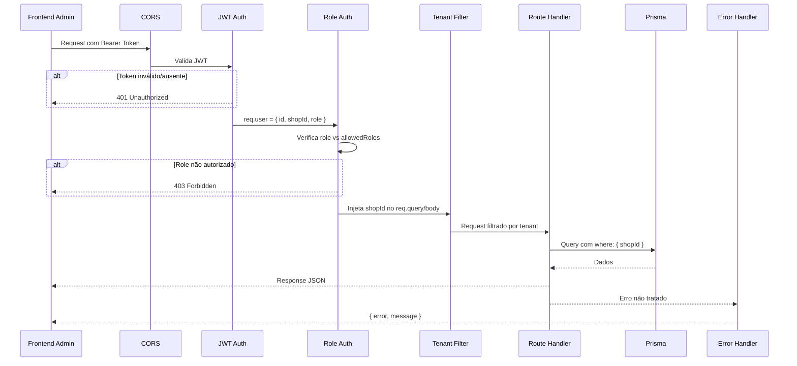
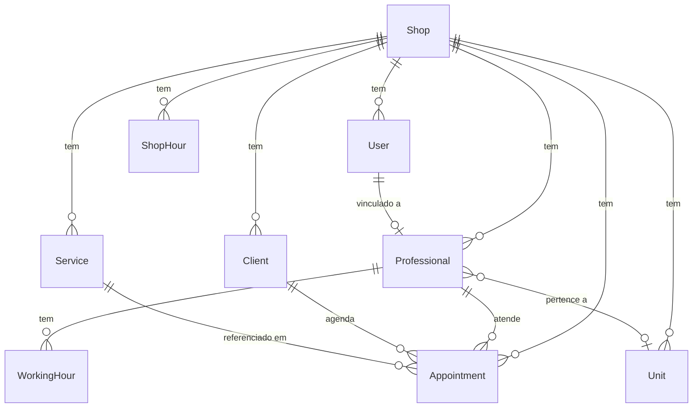

# Design Técnico — Trinity Scheduler Core Backend

## Visão Geral

O Trinity Scheduler Core é uma API REST construída com Express.js, Prisma ORM e PostgreSQL 16, servindo dois frontends: o painel do cliente (trinity-scheduler-client) para agendamentos e o painel administrativo (trinity-scheduler-admin) para gestão do estabelecimento.

A API expõe dois grupos de endpoints:
- **Endpoints públicos do cliente** (`/auth/*`, `/services`, `/addons`, `/professionals`, `/availability/*`, `/appointments`) — autenticação por telefone + clientId UUID
- **Endpoints administrativos** (`/admin/*`) — autenticação por email/senha com JWT, protegidos por middleware de autenticação e autorização por role

O sistema suporta 4 roles (admin, leader, professional, client) com isolamento multi-tenant por `shopId`, onde o role `admin` tem acesso global a todos os estabelecimentos.

### Decisões de Design

1. **Dois fluxos de autenticação separados**: O cliente se autentica por telefone (sem senha, sem JWT) recebendo um UUID. O painel admin usa email/senha com JWT contendo `shopId` e `role`.
2. **Multi-tenant via middleware**: Todo endpoint `/admin/*` filtra automaticamente por `shopId` extraído do JWT, exceto para role `admin`.
3. **Cálculo de disponibilidade server-side**: Slots são calculados cruzando horários de funcionamento do shop, horários de trabalho do profissional, horários de almoço e agendamentos existentes.
4. **Prisma como única camada de acesso a dados**: Sem queries SQL raw, usando Prisma Client para todas as operações.
5. **Valores financeiros em centavos (Int)**: Todos os campos monetários (price, totalSpent, revenue) são armazenados como inteiros em centavos. O frontend envia e recebe valores em centavos. Exemplo: R$ 45,00 = 4500.
6. **Link de acesso do cliente via base64**: O frontend client recebe o shopId via URL param codificado em base64. O formato é `base64(JSON.stringify({ shopId, clientId? }))`. Isso permite que cada leader compartilhe um link único para seus clientes acessarem o agendamento do seu estabelecimento.
7. **Documentação Swagger/OpenAPI**: Todos os endpoints são documentados com swagger-jsdoc + swagger-ui-express, acessível em `/api-docs`. Cada rota possui anotações JSDoc com tags, parâmetros, request body, responses e schemas.

## Arquitetura

```mermaid
graph TB
    subgraph Frontends
        CLIENT[trinity-scheduler-client<br/>React + Vite]
        ADMIN[trinity-scheduler-admin<br/>React + Vite]
    end

    subgraph "trinity-scheduler-core (Express.js)"
        CORS[CORS Middleware]
        ERR[Error Handler Middleware]

        subgraph "Rotas Públicas"
            AUTH_CLIENT[/auth/*]
            SERVICES[/services]
            ADDONS[/addons]
            PROFESSIONALS[/professionals]
            AVAILABILITY[/availability/*]
            APPOINTMENTS[/appointments]
        end

        subgraph "Rotas Admin"
            JWT_MW[JWT Auth Middleware]
            ROLE_MW[Role Authorization Middleware]
            TENANT_MW[Tenant Filter Middleware]
            AUTH_ADMIN[/admin/auth/*]
            SHOP[/admin/shop/*]
            ADMIN_APPT[/admin/appointments]
            ADMIN_CLIENTS[/admin/clients]
            ADMIN_SERVICES[/admin/services]
            ADMIN_PROF[/admin/professionals]
            ADMIN_UNITS[/admin/units]
            DASHBOARD[/admin/dashboard/*]
        end

        subgraph "Camada de Serviço"
            AVAIL_SVC[AvailabilityService]
            APPT_SVC[AppointmentService]
        end
    end

    subgraph "Banco de Dados"
        PG[(PostgreSQL 16)]
        PRISMA[Prisma ORM]
    end

    CLIENT --> AUTH_CLIENT
    CLIENT --> SERVICES
    CLIENT --> ADDONS
    CLIENT --> PROFESSIONALS
    CLIENT --> AVAILABILITY
    CLIENT --> APPOINTMENTS

    ADMIN --> AUTH_ADMIN
    ADMIN --> JWT_MW
    JWT_MW --> ROLE_MW
    ROLE_MW --> TENANT_MW
    TENANT_MW --> SHOP
    TENANT_MW --> ADMIN_APPT
    TENANT_MW --> ADMIN_CLIENTS
    TENANT_MW --> ADMIN_SERVICES
    TENANT_MW --> ADMIN_PROF
    TENANT_MW --> ADMIN_UNITS
    TENANT_MW --> DASHBOARD

    AVAILABILITY --> AVAIL_SVC
    ADMIN_APPT --> APPT_SVC
    APPOINTMENTS --> APPT_SVC

    AVAIL_SVC --> PRISMA
    APPT_SVC --> PRISMA
    SHOP --> PRISMA
    ADMIN_CLIENTS --> PRISMA
    ADMIN_SERVICES --> PRISMA
    ADMIN_PROF --> PRISMA
    ADMIN_UNITS --> PRISMA
    DASHBOARD --> PRISMA
    PRISMA --> PG
```

### Pipeline de Request (Admin)



## Componentes e Interfaces

### Estrutura de Pastas

```
trinity-scheduler-core/
├── docker-compose.yml
├── package.json
├── tsconfig.json
├── .env
├── prisma/
│   └── schema.prisma
└── src/
    ├── index.ts                    # Entry point: cria app e escuta porta
    ├── app.ts                      # Configura Express, middlewares globais, monta rotas
    ├── config/
    │   ├── env.ts                  # Variáveis de ambiente tipadas
    │   └── swagger.ts              # Configuração swagger-jsdoc + swagger-ui-express
    ├── middlewares/
    │   ├── auth.ts                 # JWT verification middleware
    │   ├── authorize.ts            # Role-based authorization middleware
    │   ├── tenantFilter.ts         # Injeta shopId filter nas queries (admin)
    │   ├── shopResolver.ts         # Resolve shopId via header/query param (client routes)
    │   └── errorHandler.ts         # Global error handler
    ├── routes/
    │   ├── index.ts                # Monta todas as rotas no app
    │   ├── client/
    │   │   ├── auth.routes.ts      # POST /auth/login, GET /auth/validate
    │   │   ├── services.routes.ts  # GET /services
    │   │   ├── addons.routes.ts    # GET /addons
    │   │   ├── professionals.routes.ts  # GET /professionals
    │   │   ├── availability.routes.ts   # GET /availability/slots, /availability/disabled-dates
    │   │   └── appointments.routes.ts   # POST, GET, PATCH /appointments
    │   └── admin/
    │       ├── auth.routes.ts      # POST /admin/auth/login, register, forgot-password
    │       ├── shop.routes.ts      # GET/PUT /admin/shop, GET/PUT /admin/shop/hours
    │       ├── appointments.routes.ts
    │       ├── clients.routes.ts
    │       ├── services.routes.ts
    │       ├── professionals.routes.ts
    │       ├── units.routes.ts
    │       └── dashboard.routes.ts
    ├── services/
    │   ├── availability.service.ts # Lógica de cálculo de slots e datas indisponíveis
    │   └── appointment.service.ts  # Lógica de criação com validação de conflito
    ├── utils/
    │   ├── prisma.ts               # Singleton do PrismaClient
    │   ├── jwt.ts                  # sign/verify helpers
    │   ├── password.ts             # hash/compare com bcrypt
    │   └── errors.ts               # Classes de erro customizadas (AppError)
    └── types/
        └── express.d.ts            # Extensão do Request com user/shopId
```

### Interfaces dos Middlewares

```typescript
// middlewares/auth.ts
// Verifica JWT do header Authorization, decodifica e injeta req.user
// Ignora rotas /admin/auth/*
export function authMiddleware(req: Request, res: Response, next: NextFunction): void;

// req.user após auth:
interface AuthUser {
  id: string;          // userId (UUID)
  shopId: string;      // shopId do estabelecimento
  role: 'admin' | 'leader' | 'professional';
  professionalId?: string; // presente quando role === 'professional'
}

// middlewares/authorize.ts
// Factory que retorna middleware verificando se req.user.role está na lista
export function authorize(...roles: string[]): RequestHandler;

// middlewares/tenantFilter.ts
// Injeta shopId nas queries para isolamento multi-tenant (admin routes)
// Admin bypassa o filtro
export function tenantFilter(req: Request, res: Response, next: NextFunction): void;

// middlewares/shopResolver.ts
// Resolve shopId para rotas do cliente via header X-Shop-Id ou query param shopId
// Valida que o shop existe no banco, injeta req.shopId
// Retorna 400 se shopId ausente, 404 se shop não existe
export function shopResolver(req: Request, res: Response, next: NextFunction): void;

// middlewares/errorHandler.ts
// Captura AppError e erros genéricos, retorna JSON padronizado
export function errorHandler(err: Error, req: Request, res: Response, next: NextFunction): void;
```

### Interfaces dos Serviços

```typescript
// services/availability.service.ts
interface Slot {
  time: string;      // "HH:mm"
  available: boolean;
}

export async function getAvailableSlots(
  shopId: string,
  professionalId: string | null,
  date: string,           // "YYYY-MM-DD"
  serviceDuration?: number // minutos, default 30
): Promise<Slot[]>;

export async function getDisabledDates(
  shopId: string,
  professionalId: string | null,
  startDate: string,      // início do range
  endDate: string         // fim do range
): Promise<string[]>;     // ["YYYY-MM-DD", ...]

// services/appointment.service.ts
export async function createAppointment(data: {
  shopId: string;
  clientId: string;
  serviceId: string;
  professionalId: string | null;
  addonIds?: string[];
  date: string;
  time: string;
}): Promise<Appointment>;

export async function cancelAppointment(
  appointmentId: string,
  reason: string
): Promise<void>;
```

### Organização de Rotas

```typescript
// routes/index.ts
import { Router } from 'express';

export function mountRoutes(app: Express): void {
  // Rotas públicas do cliente (com shopResolver para identificar o estabelecimento)
  app.use('/auth', shopResolver, clientAuthRoutes);
  app.use('/services', shopResolver, clientServicesRoutes);
  app.use('/addons', shopResolver, clientAddonsRoutes);
  app.use('/professionals', shopResolver, clientProfessionalsRoutes);
  app.use('/availability', shopResolver, clientAvailabilityRoutes);
  app.use('/appointments', shopResolver, clientAppointmentsRoutes);

  // Rotas admin (com auth JWT)
  app.use('/admin/auth', adminAuthRoutes);  // sem middleware de auth
  app.use('/admin', authMiddleware, tenantFilter, adminShopRoutes);
  app.use('/admin', authMiddleware, tenantFilter, adminAppointmentsRoutes);
  app.use('/admin', authMiddleware, tenantFilter, adminClientsRoutes);
  app.use('/admin', authMiddleware, tenantFilter, adminServicesRoutes);
  app.use('/admin', authMiddleware, tenantFilter, adminProfessionalsRoutes);
  app.use('/admin', authMiddleware, tenantFilter, adminUnitsRoutes);
  app.use('/admin', authMiddleware, tenantFilter, adminDashboardRoutes);
}
```

### Classes de Erro

```typescript
// utils/errors.ts
export class AppError extends Error {
  constructor(
    public statusCode: number,
    public code: string,
    message: string
  ) {
    super(message);
  }
}

// Uso:
throw new AppError(404, 'NOT_FOUND', 'Serviço não encontrado');
throw new AppError(409, 'CONFLICT', 'Horário não disponível');
throw new AppError(400, 'VALIDATION_ERROR', 'Campo phone é obrigatório');
```

## Modelos de Dados

### Prisma Schema

```prisma
generator client {
  provider = "prisma-client-js"
}

datasource db {
  provider = "postgresql"
  url      = env("DATABASE_URL")
}

model Shop {
  id        String   @id @default(uuid())
  name      String
  phone     String?
  email     String?
  address   String?
  createdAt DateTime @default(now())
  updatedAt DateTime @updatedAt

  users         User[]
  services      Service[]
  professionals Professional[]
  clients       Client[]
  units         Unit[]
  appointments  Appointment[]
  shopHours     ShopHour[]
}

model User {
  id             String   @id @default(uuid())
  shopId         String
  name           String
  email          String   @unique
  passwordHash   String
  role           Role     @default(leader)
  professionalId String?  @unique
  resetToken     String?
  resetTokenExp  DateTime?
  createdAt      DateTime @default(now())
  updatedAt      DateTime @updatedAt

  shop         Shop          @relation(fields: [shopId], references: [id])
  professional Professional? @relation(fields: [professionalId], references: [id])
}

enum Role {
  admin
  leader
  professional
}

model ShopHour {
  id     String  @id @default(uuid())
  shopId String
  day    String  // "Segunda", "Terça", etc.
  start  String? // "09:00" ou null (fechado)
  end    String? // "19:00" ou null (fechado)

  shop Shop @relation(fields: [shopId], references: [id])

  @@unique([shopId, day])
}

model Service {
  id          String      @id @default(uuid())
  shopId      String
  name        String
  duration    Int         // minutos
  price       Int         // centavos (ex: 4500 = R$ 45,00)
  description String?
  icon        String?
  image       String?
  type        ServiceType @default(service)
  active      Boolean     @default(true)
  createdAt   DateTime    @default(now())
  updatedAt   DateTime    @updatedAt

  shop         Shop          @relation(fields: [shopId], references: [id])
  appointments Appointment[]
}

enum ServiceType {
  service
  addon
}

model Professional {
  id          String   @id @default(uuid())
  shopId      String
  unitId      String?
  name        String
  avatar      String?
  specialties String[] // array de strings
  phone       String?
  email       String?
  active      Boolean  @default(true)
  createdAt   DateTime @default(now())
  updatedAt   DateTime @updatedAt

  shop         Shop              @relation(fields: [shopId], references: [id])
  unit         Unit?             @relation(fields: [unitId], references: [id])
  workingHours WorkingHour[]
  appointments Appointment[]
  user         User?
}

model WorkingHour {
  id             String  @id @default(uuid())
  professionalId String
  day            String  // "Segunda", "Terça", etc.
  start          String? // "09:00"
  end            String? // "18:00"
  lunchStart     String? // "12:00"
  lunchEnd       String? // "13:00"

  professional Professional @relation(fields: [professionalId], references: [id], onDelete: Cascade)

  @@unique([professionalId, day])
}

model Client {
  id         String    @id @default(uuid())
  shopId     String
  name       String?
  phone      String
  email      String?
  notes      String?
  birthday   String?
  totalSpent Int       @default(0) // centavos
  lastVisit  DateTime?
  createdAt  DateTime  @default(now())
  updatedAt  DateTime  @updatedAt

  shop         Shop          @relation(fields: [shopId], references: [id])
  appointments Appointment[]

  @@unique([shopId, phone])
}

model Appointment {
  id             String            @id @default(uuid())
  shopId         String
  clientId       String
  serviceId      String
  professionalId String
  date           String            // "YYYY-MM-DD"
  time           String            // "HH:mm"
  duration       Int               // minutos (calculado do serviço + adicionais)
  price          Int               // centavos (calculado do serviço + adicionais)
  status         AppointmentStatus @default(confirmed)
  cancelReason   String?
  notes          String?
  createdAt      DateTime          @default(now())
  updatedAt      DateTime          @updatedAt

  shop         Shop         @relation(fields: [shopId], references: [id])
  client       Client       @relation(fields: [clientId], references: [id])
  service      Service      @relation(fields: [serviceId], references: [id])
  professional Professional @relation(fields: [professionalId], references: [id])
}

enum AppointmentStatus {
  confirmed
  cancelled
  completed
  noshow
}

model Unit {
  id        String   @id @default(uuid())
  shopId    String
  name      String
  address   String?
  phone     String?
  createdAt DateTime @default(now())
  updatedAt DateTime @updatedAt

  shop          Shop           @relation(fields: [shopId], references: [id])
  professionals Professional[]
}
```

### Diagrama ER



### Lógica de Cálculo de Disponibilidade

O cálculo de slots disponíveis é o componente mais complexo do sistema. Segue o algoritmo:

```
getAvailableSlots(shopId, professionalId, date, serviceDuration):

1. Buscar horário de funcionamento do shop para o dia da semana (ShopHour)
   - Se start/end = null → dia fechado → retornar []

2. Buscar profissionais alvo:
   - Se professionalId fornecido → [profissional]
   - Se null → todos os profissionais ativos do shop

3. Para cada profissional:
   a. Buscar WorkingHour do profissional para o dia da semana
      - Se start/end = null → profissional não trabalha nesse dia → pular
   b. Calcular intervalo efetivo:
      - effectiveStart = max(shopHour.start, workingHour.start)
      - effectiveEnd = min(shopHour.end, workingHour.end)
   c. Gerar slots de 30 em 30 minutos entre effectiveStart e effectiveEnd
   d. Remover slots que caem no horário de almoço (lunchStart..lunchEnd)
   e. Buscar agendamentos existentes do profissional na data
   f. Remover slots que conflitam com agendamentos existentes
      (slot conflita se: slotTime < appointmentEnd AND slotTime + serviceDuration > appointmentStart)

4. Se professionalId fornecido → retornar slots do profissional
   Se null → unir slots: um slot é "available" se pelo menos 1 profissional tem aquele horário disponível

Retorno: [{ time: "09:00", available: true }, { time: "09:30", available: false }, ...]
```

### Abordagem Multi-Tenant

O isolamento por `shopId` é implementado em 3 camadas:

1. **JWT Payload**: O token contém `{ id, shopId, role }`. O `shopId` é extraído no middleware `auth.ts`.
2. **Tenant Filter Middleware**: Injeta `shopId` automaticamente:
   - Em queries (GET): adiciona `where: { shopId }` via Prisma
   - Em criações (POST): adiciona `shopId` ao body
   - Admin (role === 'admin'): bypassa o filtro, permitindo acesso cross-tenant
3. **Constraint no banco**: Todos os modelos principais têm `shopId` como FK para `Shop`, garantindo integridade referencial.

### Resolução de shopId nos Endpoints do Cliente

O MVP suporta múltiplos shops desde o início. Para os endpoints do cliente (`/services`, `/appointments`, etc.), o `shopId` é resolvido via parâmetro base64 na URL:

1. **Link de acesso**: Cada leader gera um link para seus clientes no formato:
   ```
   https://app.example.com?ref={base64}
   ```
   Onde `{base64}` = `base64(JSON.stringify({ shopId: "uuid", clientId?: "uuid" }))`

2. **Fluxo no frontend client**:
   - Ao carregar, decodifica o param `ref` da URL
   - Extrai `shopId` (obrigatório) e `clientId` (opcional)
   - Salva `shopId` e `clientId` (se presente) no localStorage
   - Envia `shopId` como header `X-Shop-Id` ou query param em todas as requisições aos endpoints do cliente

3. **Middleware de resolução de shop (client routes)**:
   - Extrai `shopId` do header `X-Shop-Id` ou query param `shopId`
   - Valida que o shop existe no banco
   - Injeta `shopId` no `req` para uso nos handlers
   - Se `shopId` ausente → retorna 400

4. **Exemplo de link com clientId** (cliente já cadastrado):
   ```
   base64('{"shopId":"abc-123","clientId":"def-456"}') → eyJzaG9wSWQiOiJhYmMtMTIzIiwiY2xpZW50SWQiOiJkZWYtNDU2In0=
   ```
   Nesse caso, o frontend pula o login por telefone e usa o clientId diretamente.


## Propriedades de Corretude

*Uma propriedade é uma característica ou comportamento que deve ser verdadeiro em todas as execuções válidas de um sistema — essencialmente, uma declaração formal sobre o que o sistema deve fazer. Propriedades servem como ponte entre especificações legíveis por humanos e garantias de corretude verificáveis por máquina.*

### Propriedade 1: Login por telefone retorna clientId válido

*Para qualquer* número de telefone, POST /auth/login deve retornar um clientId UUID válido. Se o telefone já existe no banco, deve retornar o clientId existente. Se não existe, deve criar um novo cliente e retornar o UUID gerado. Em ambos os casos, o clientId retornado deve corresponder a um registro válido no banco.

**Valida: Requisitos 1.1, 1.2**

### Propriedade 2: Round-trip de validação do cliente

*Para qualquer* cliente criado via POST /auth/login, uma chamada subsequente a GET /auth/validate?clientId={id} deve retornar status 200 com os dados básicos (clientId, name) correspondentes ao registro no banco.

**Valida: Requisitos 1.4**

### Propriedade 3: Round-trip de autenticação admin (login → JWT → dados)

*Para qualquer* usuário cadastrado com email e senha válidos, POST /admin/auth/login deve retornar um JWT que, ao ser decodificado, contém os campos id, shopId e role correspondentes ao usuário. A senha nunca deve aparecer no payload do JWT.

**Valida: Requisitos 2.1, 2.3**

### Propriedade 4: Senhas armazenadas como hash bcrypt

*Para qualquer* usuário registrado no sistema, o campo passwordHash armazenado no banco deve ser um hash bcrypt válido e nunca deve ser igual à senha em texto plano. Além disso, bcrypt.compare(senhaOriginal, hash) deve retornar true.

**Valida: Requisitos 2.4**

### Propriedade 5: Atomicidade do registro (leader + shop + professional)

*Para qualquer* conjunto válido de dados de registro (owner, shop, professional), POST /admin/auth/register deve criar exatamente 3 registros (User com role leader, Shop, Professional) de forma atômica. Se qualquer parte falhar, nenhum registro deve existir no banco (rollback completo).

**Valida: Requisitos 3.1, 3.4**

### Propriedade 6: Token de redefinição com validade máxima de 1 hora

*Para qualquer* email cadastrado enviado a POST /admin/auth/forgot-password, o token de redefinição gerado deve ter uma data de expiração (resetTokenExp) no máximo 1 hora após o momento da criação.

**Valida: Requisitos 4.1, 4.3**

### Propriedade 7: Round-trip de dados do estabelecimento

*Para qualquer* conjunto válido de dados de shop, ao executar PUT /admin/shop seguido de GET /admin/shop com o mesmo token de leader, os dados retornados devem ser iguais aos dados enviados no PUT.

**Valida: Requisitos 5.1, 5.2**

### Propriedade 8: Round-trip de horários de funcionamento

*Para qualquer* conjunto válido de horários (incluindo dias com start/end null para fechado), ao executar PUT /admin/shop/hours seguido de GET /admin/shop/hours, os horários retornados devem ser iguais aos enviados.

**Valida: Requisitos 6.1, 6.2**

### Propriedade 9: Filtragem de tipo em serviços e adicionais

*Para qualquer* conjunto de registros Service no banco contendo uma mistura de types "service" e "addon", GET /services deve retornar exclusivamente registros com type="service" e GET /addons deve retornar exclusivamente registros com type="addon". A união dos dois conjuntos deve cobrir todos os registros ativos.

**Valida: Requisitos 7.1, 7.2, 8.1, 8.2**

### Propriedade 10: Slots de disponibilidade respeitam restrições

*Para qualquer* profissional, data e conjunto de agendamentos existentes, todos os slots retornados por GET /availability/slots devem satisfazer simultaneamente: (a) estar dentro do horário de funcionamento do shop, (b) estar dentro do horário de trabalho do profissional, (c) não sobrepor o horário de almoço do profissional, (d) não conflitar com agendamentos existentes. Nenhum slot marcado como "available: true" deve violar qualquer dessas restrições.

**Valida: Requisitos 10.1, 10.3, 10.4**

### Propriedade 11: União de disponibilidade (sem professionalId)

*Para qualquer* data e conjunto de profissionais, quando GET /availability/slots é chamado sem professionalId, um slot deve ser marcado como "available: true" se e somente se pelo menos um profissional tem aquele horário disponível. Equivalentemente: um slot é "available: false" somente se TODOS os profissionais estão indisponíveis naquele horário.

**Valida: Requisitos 10.2**

### Propriedade 12: Datas indisponíveis são consistentes com slots

*Para qualquer* profissional e range de datas, uma data retornada por GET /availability/disabled-dates deve ter zero slots disponíveis quando consultada via GET /availability/slots. Inversamente, uma data NÃO retornada como indisponível deve ter pelo menos um slot disponível.

**Valida: Requisitos 11.1, 11.2, 11.3**

### Propriedade 13: Criação de agendamento com detecção de conflito

*Para qualquer* slot marcado como "available: true", POST /appointments com dados válidos deve criar o agendamento com status "confirmed". Após a criação, o mesmo slot deve passar a ser "available: false" para o mesmo profissional. Tentativas subsequentes de agendar o mesmo slot/profissional devem retornar status 409.

**Valida: Requisitos 12.1, 12.3**

### Propriedade 14: Auto-atribuição de profissional

*Para qualquer* agendamento criado via POST /appointments com professionalId null, o sistema deve atribuir um professionalId válido correspondente a um profissional que estava disponível no horário solicitado.

**Valida: Requisitos 12.2**

### Propriedade 15: Round-trip de cancelamento

*Para qualquer* agendamento com status "confirmed", PATCH /appointments/{id}/cancel deve alterar o status para "cancelled" e armazenar o motivo. Uma consulta subsequente GET /appointments deve refletir o status "cancelled" e o cancelReason informado.

**Valida: Requisitos 14.1**

### Propriedade 16: Isolamento de agendamentos por role professional

*Para qualquer* profissional autenticado, GET /admin/appointments deve retornar exclusivamente agendamentos onde professionalId corresponde ao próprio profissional. Nenhum agendamento de outro profissional deve aparecer nos resultados.

**Valida: Requisitos 15.2**

### Propriedade 17: Busca de clientes filtra por nome ou telefone

*Para qualquer* termo de busca e conjunto de clientes, GET /admin/clients?search={termo} deve retornar apenas clientes cujo name ou phone contém o termo. O campo "total" deve refletir a contagem real de resultados filtrados.

**Valida: Requisitos 16.2, 16.3**

### Propriedade 18: CRUD round-trip de recursos admin

*Para qualquer* recurso admin (clients, services, professionals, units), a sequência POST (criar) → GET/{id} (ler) deve retornar os mesmos dados enviados. PUT/{id} (atualizar) → GET/{id} deve refletir os dados atualizados. DELETE/{id} → GET/{id} deve retornar 404.

**Valida: Requisitos 16.4-16.7, 17.2-17.5, 18.2-18.5, 19.2-19.5**

### Propriedade 19: Autorização por role — professional tem acesso somente leitura

*Para qualquer* profissional autenticado, requisições de escrita (POST, PUT, DELETE) aos endpoints de shop, shop/hours, clients, dashboard devem retornar status 403. Para services, units e professionals (exceto o próprio registro), POST e DELETE devem retornar 403. PUT em professionals deve ser permitido apenas para o próprio registro.

**Valida: Requisitos 5.3, 6.4, 15.7, 16.8, 17.6, 18.6, 18.7, 19.6, 20.3**

### Propriedade 20: Cálculo correto de métricas do dashboard

*Para qualquer* conjunto de agendamentos em uma data, GET /admin/dashboard/stats deve retornar: revenue igual à soma dos preços (em centavos) dos agendamentos confirmed/completed, appointmentCount igual ao total de agendamentos, topService igual ao serviço com mais agendamentos, e newClients igual ao número de clientes criados naquela data.

**Valida: Requisitos 20.1**

### Propriedade 21: Isolamento multi-tenant por shopId

*Para qualquer* par de shops (A e B) e um leader autenticado no shop A, todas as operações de leitura devem retornar exclusivamente dados do shop A. Todas as operações de criação devem associar o registro ao shop A. Tentativas de acessar recursos do shop B devem retornar 404 (não 403).

**Valida: Requisitos 23.1, 23.2, 23.3**

### Propriedade 22: Admin bypassa filtro de tenant

*Para qualquer* usuário com role "admin", todas as operações de leitura devem retornar dados de todos os shops. O admin deve ter acesso a qualquer recurso independente do shopId.

**Valida: Requisitos 21.6**

### Propriedade 23: Formato consistente de respostas de erro

*Para qualquer* resposta com status HTTP >= 400, o body deve ser um JSON contendo os campos "error" (string com código do erro) e "message" (string com descrição legível). Nenhuma resposta de erro deve retornar HTML ou texto plano.

**Valida: Requisitos 22.1, 22.2, 22.3**

### Propriedade 24: JWT obrigatório em endpoints admin protegidos

*Para qualquer* endpoint /admin/* (exceto /admin/auth/*), requisições sem header Authorization ou com JWT inválido/expirado devem retornar status 401. Nenhum dado deve ser retornado sem autenticação válida.

**Valida: Requisitos 21.1, 21.4, 21.5**

### Propriedade 25: Documentação Swagger cobre todos os endpoints

*Para qualquer* rota registrada no Express, deve existir uma entrada correspondente na spec OpenAPI gerada pelo swagger-jsdoc. A spec deve conter pelo menos: summary, tags, parâmetros (se aplicável), requestBody (se POST/PUT/PATCH), e responses com schemas válidos.

**Valida: Requisito 24**

## Documentação Swagger/OpenAPI

### Configuração

O projeto usa `swagger-jsdoc` para gerar a spec OpenAPI 3.0 a partir de anotações JSDoc nos arquivos de rotas, e `swagger-ui-express` para servir a UI interativa.

```typescript
// config/swagger.ts
import swaggerJsdoc from 'swagger-jsdoc';

const options: swaggerJsdoc.Options = {
  definition: {
    openapi: '3.0.0',
    info: {
      title: 'Trinity Scheduler Core API',
      version: '1.0.0',
      description: 'API backend do Trinity Scheduler — serve o painel do cliente e o painel administrativo',
    },
    servers: [{ url: '/api', description: 'API Server' }],
    tags: [
      { name: 'Client Auth', description: 'Autenticação do cliente (telefone + UUID)' },
      { name: 'Client Services', description: 'Serviços e adicionais (público)' },
      { name: 'Client Professionals', description: 'Profissionais disponíveis (público)' },
      { name: 'Client Availability', description: 'Disponibilidade de horários (público)' },
      { name: 'Client Appointments', description: 'Agendamentos do cliente' },
      { name: 'Admin Auth', description: 'Autenticação admin (login, registro, forgot-password)' },
      { name: 'Admin Shop', description: 'Gestão do estabelecimento' },
      { name: 'Admin Appointments', description: 'Gestão de agendamentos (admin panel)' },
      { name: 'Admin Clients', description: 'Gestão de clientes' },
      { name: 'Admin Services', description: 'Gestão de serviços e adicionais' },
      { name: 'Admin Professionals', description: 'Gestão de profissionais' },
      { name: 'Admin Units', description: 'Gestão de unidades' },
      { name: 'Admin Dashboard', description: 'Métricas e relatórios' },
    ],
    components: {
      securitySchemes: {
        bearerAuth: {
          type: 'http',
          scheme: 'bearer',
          bearerFormat: 'JWT',
        },
      },
    },
  },
  apis: ['./src/routes/**/*.ts'],
};

export const swaggerSpec = swaggerJsdoc(options);
```

```typescript
// app.ts (trecho de montagem)
import swaggerUi from 'swagger-ui-express';
import { swaggerSpec } from './config/swagger';

app.use('/api-docs', swaggerUi.serve, swaggerUi.setup(swaggerSpec));
```

### Padrão de Anotação JSDoc por Rota

Cada arquivo de rota deve conter anotações `@swagger` acima de cada endpoint. Exemplo:

```typescript
/**
 * @swagger
 * /auth/login:
 *   post:
 *     tags: [Client Auth]
 *     summary: Autenticação do cliente por telefone
 *     description: Autentica ou cria um cliente pelo número de telefone. Retorna o clientId (UUID).
 *     parameters:
 *       - in: header
 *         name: X-Shop-Id
 *         required: true
 *         schema:
 *           type: string
 *           format: uuid
 *         description: ID do estabelecimento
 *     requestBody:
 *       required: true
 *       content:
 *         application/json:
 *           schema:
 *             type: object
 *             required: [phone]
 *             properties:
 *               phone:
 *                 type: string
 *                 example: "11999999999"
 *     responses:
 *       200:
 *         description: Cliente autenticado com sucesso
 *         content:
 *           application/json:
 *             schema:
 *               type: object
 *               properties:
 *                 clientId:
 *                   type: string
 *                   format: uuid
 *       400:
 *         description: Campo phone ausente ou inválido
 *         content:
 *           application/json:
 *             schema:
 *               $ref: '#/components/schemas/Error'
 */

/**
 * @swagger
 * /admin/services:
 *   get:
 *     tags: [Admin Services]
 *     summary: Listar serviços e adicionais
 *     security:
 *       - bearerAuth: []
 *     responses:
 *       200:
 *         description: Lista de serviços
 *         content:
 *           application/json:
 *             schema:
 *               type: array
 *               items:
 *                 $ref: '#/components/schemas/Service'
 *       401:
 *         $ref: '#/components/responses/Unauthorized'
 *   post:
 *     tags: [Admin Services]
 *     summary: Criar serviço ou adicional
 *     security:
 *       - bearerAuth: []
 *     requestBody:
 *       required: true
 *       content:
 *         application/json:
 *           schema:
 *             $ref: '#/components/schemas/ServiceInput'
 *     responses:
 *       201:
 *         description: Serviço criado
 *       403:
 *         $ref: '#/components/responses/Forbidden'
 */
```

### Schemas Reutilizáveis (components/schemas)

Os schemas devem ser definidos em um arquivo separado ou inline no swagger config:

| Schema | Campos | Usado em |
|--------|--------|----------|
| `Error` | `error` (string), `message` (string) | Todas as respostas de erro |
| `Client` | id, shopId, name, phone, email, notes, birthday, totalSpent (int/centavos), lastVisit, createdAt | GET /admin/clients |
| `ClientInput` | name, phone, email, notes, birthday | POST/PUT /admin/clients |
| `Service` | id, shopId, name, duration, price (int/centavos), description, icon, image, type, active | GET /services, /admin/services |
| `ServiceInput` | name, duration, price (int/centavos), description, icon, image, type | POST/PUT /admin/services |
| `Professional` | id, shopId, unitId, name, avatar, specialties, workingHours, phone, email | GET /professionals, /admin/professionals |
| `ProfessionalInput` | unitId, name, avatar, specialties, workingHours, phone, email | POST/PUT /admin/professionals |
| `Appointment` | id, shopId, clientId, serviceId, serviceName, professionalId, professionalName, date, time, duration, price (int/centavos), status, cancelReason, notes | GET /appointments, /admin/appointments |
| `AppointmentInput` | clientId, serviceId, professionalId, date, time, notes | POST /appointments, /admin/appointments |
| `Unit` | id, shopId, name, address, phone | GET /admin/units |
| `UnitInput` | name, address, phone | POST/PUT /admin/units |
| `Shop` | name, phone, email, address | GET/PUT /admin/shop |
| `ShopHour` | day, start, end | GET/PUT /admin/shop/hours |
| `Slot` | time (string), available (boolean) | GET /availability/slots |
| `DashboardStats` | revenue (int/centavos), appointmentCount, topService, newClients | GET /admin/dashboard/stats |
| `LoginRequest` | phone (string) | POST /auth/login |
| `AdminLoginRequest` | email, password | POST /admin/auth/login |
| `AdminLoginResponse` | user (name, email, avatar, role), token | POST /admin/auth/login |
| `RegisterRequest` | owner, shop, professional | POST /admin/auth/register |

### Responses Reutilizáveis

```yaml
components:
  responses:
    Unauthorized:
      description: Token JWT ausente, inválido ou expirado
      content:
        application/json:
          schema:
            $ref: '#/components/schemas/Error'
    Forbidden:
      description: Role sem permissão para este endpoint
      content:
        application/json:
          schema:
            $ref: '#/components/schemas/Error'
    NotFound:
      description: Recurso não encontrado
      content:
        application/json:
          schema:
            $ref: '#/components/schemas/Error'
```

### Acesso

- **URL**: `GET /api-docs` — UI interativa do Swagger
- **JSON spec**: `GET /api-docs.json` — spec OpenAPI em JSON (para importação em Postman, Insomnia, etc.)

## Tratamento de Erros

### Formato Padrão de Erro

Todas as respostas de erro seguem o formato:

```json
{
  "error": "VALIDATION_ERROR",
  "message": "O campo phone é obrigatório"
}
```

### Códigos de Erro por Status HTTP

| Status | Código | Cenário |
|--------|--------|---------|
| 400 | `VALIDATION_ERROR` | Campos obrigatórios ausentes, dados inválidos |
| 401 | `UNAUTHORIZED` | JWT ausente, inválido ou expirado |
| 403 | `FORBIDDEN` | Role sem permissão para o endpoint |
| 404 | `NOT_FOUND` | Recurso não encontrado (ou de outro tenant) |
| 409 | `CONFLICT` | Email duplicado, horário já ocupado |
| 500 | `INTERNAL_ERROR` | Erro não tratado (mensagem genérica ao cliente, detalhes no log) |

### Estratégia de Tratamento

1. **AppError customizado**: Erros de negócio lançam `AppError(statusCode, code, message)` que o error handler captura e formata.
2. **Prisma errors**: Erros do Prisma (P2002 unique constraint, P2025 record not found) são mapeados para AppError no error handler.
3. **Erros não tratados**: Capturados pelo error handler global, logados com `console.error` e retornados como 500 com mensagem genérica.
4. **Validação de entrada**: Feita no início de cada handler com verificação de campos obrigatórios. Retorna 400 imediatamente se inválido.

```typescript
// Exemplo de mapeamento de erros Prisma
if (err.code === 'P2002') {
  return res.status(409).json({ error: 'CONFLICT', message: 'Registro duplicado' });
}
if (err.code === 'P2025') {
  return res.status(404).json({ error: 'NOT_FOUND', message: 'Recurso não encontrado' });
}
```

## Estratégia de Testes

### Abordagem Dual: Testes Unitários + Testes de Propriedade

O projeto utiliza duas abordagens complementares de teste:

- **Testes unitários** (Vitest): Verificam exemplos específicos, edge cases e condições de erro
- **Testes de propriedade** (fast-check + Vitest): Verificam propriedades universais com inputs gerados aleatoriamente

### Biblioteca de Testes de Propriedade

- **fast-check** (`fc`) — biblioteca de property-based testing para JavaScript/TypeScript
- Integrada com Vitest como test runner
- Cada teste de propriedade deve executar no mínimo 100 iterações

### Configuração de Testes de Propriedade

Cada teste de propriedade deve:
1. Referenciar a propriedade do design via comentário tag
2. Usar o formato: `// Feature: trinity-scheduler-core-backend, Property {N}: {título}`
3. Executar no mínimo 100 iterações via `fc.assert(property, { numRuns: 100 })`
4. Cada propriedade de corretude deve ser implementada por UM ÚNICO teste de propriedade

### Escopo dos Testes Unitários

Testes unitários focam em:
- Exemplos específicos que demonstram comportamento correto (ex: login com telefone conhecido)
- Edge cases (ex: telefone vazio, JWT expirado, agendamento já cancelado)
- Condições de erro (ex: serviceId inexistente, email duplicado)
- Pontos de integração entre componentes (ex: middleware chain)

### Escopo dos Testes de Propriedade

Testes de propriedade focam em:
- Propriedades universais que devem valer para todos os inputs (ex: isolamento multi-tenant)
- Cobertura abrangente via randomização (ex: qualquer combinação de horários de trabalho)
- Round-trips (ex: criar → ler, atualizar → ler, serializar → deserializar)
- Invariantes (ex: slots disponíveis nunca violam restrições de horário)

### Estrutura de Testes

```
trinity-scheduler-core/
└── src/
    └── __tests__/
        ├── unit/
        │   ├── auth.test.ts
        │   ├── availability.test.ts
        │   ├── appointments.test.ts
        │   └── middleware.test.ts
        └── properties/
            ├── auth.property.test.ts
            ├── availability.property.test.ts
            ├── appointments.property.test.ts
            ├── crud.property.test.ts
            ├── authorization.property.test.ts
            └── tenant.property.test.ts
```

### Exemplo de Teste de Propriedade

```typescript
// Feature: trinity-scheduler-core-backend, Property 10: Slots de disponibilidade respeitam restrições
it('slots disponíveis nunca violam restrições de horário', async () => {
  await fc.assert(
    fc.asyncProperty(
      arbitraryShopHours(),
      arbitraryWorkingHours(),
      arbitraryAppointments(),
      arbitraryDate(),
      async (shopHours, workingHours, appointments, date) => {
        const slots = await getAvailableSlots(shopId, professionalId, date);
        for (const slot of slots.filter(s => s.available)) {
          expect(isWithinShopHours(slot.time, shopHours)).toBe(true);
          expect(isWithinWorkingHours(slot.time, workingHours)).toBe(true);
          expect(isNotDuringLunch(slot.time, workingHours)).toBe(true);
          expect(hasNoConflict(slot.time, appointments)).toBe(true);
        }
      }
    ),
    { numRuns: 100 }
  );
});
```
